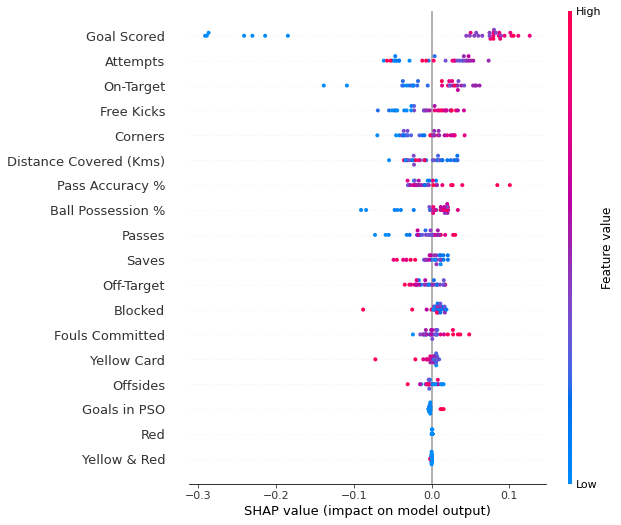
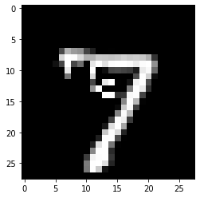
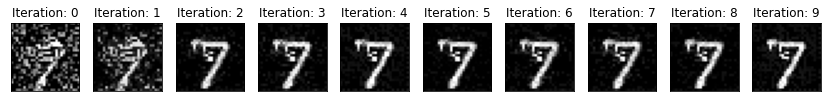
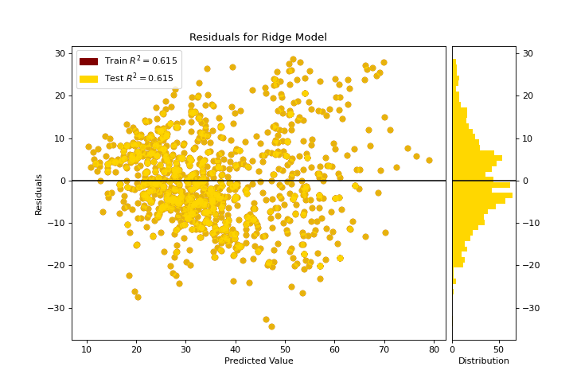
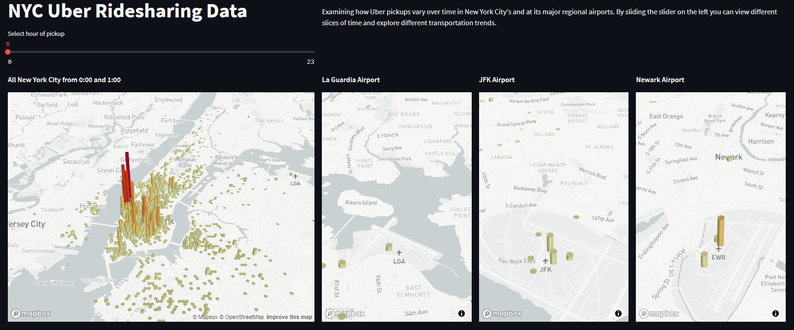
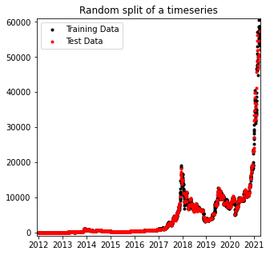
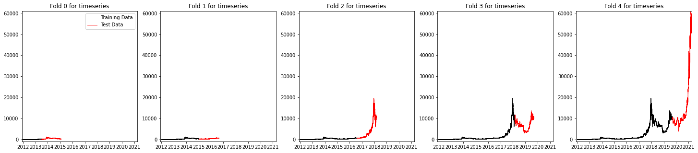

<!-- _class: invert lead -->

# How to Guarantee _No One_ Understands<br>What You Did in<br>Your Machine Learning Project <!--fit-->

Jesper Dramsch

---


## Motivation
<br><br>
💻 + 🧠 = Awesome!

---

## Outline

* Communication
* Ethics
* Explainability
* Data Visualizations
* Interactivity
* Model Validation


---

## How do People Understand? <!--fit-->

<br>


* They understand your language
* Relate things to what they already know
* Feel heard
* Have concerns addressed

<!--We need to understand to be able to work against it-->

---

## Communicate like a Pro<!--fit-->


<!--These communication hacks guarantee no one gets it:-->
* Ignore subject matter expertise
* Dismiss existing solutions
* No need to build trust
* Never set expectations
* Especially not about labelling

<!--Bonus points for condescension-->

---

## Ethical Considerations <!--fit-->

<!--When talking to SMEs ignore concerns-->


<br>

* Privacy concerns
* Anonymisation
* Problematic Applications
* Discrimination
* Policing

---

<!-- _class: invert lead -->

## Be Super Specific about Models <!--fit-->

<!--To be make absolutely sure no one understands your ML model-->


Stakeholders love nothing more than a detailed read-out of 

- Parameters
- Model size
- Learning Rate Schedules
- Hours of Training


---

<!-- _class: invert lead -->

# Avoid These Tools to be Extra Confusing <!--fit-->

---
<!-- _class: invert lead -->

# Baseline Models <!--fit-->

Existing or interpretable models to compare to

---

# Baseline Models


---

# Baseline Models

```python
from sklearn.dummy import DummyClassifier

dummy_clf = DummyClassifier()
dummy_clf.fit(X, y)

dummy_clf.score(X, y)
```

The simplest of baselines.

---
<!-- _class: invert lead -->

# Machine Learning Explainability <!--fit-->

Statistical methods to explain black box models.

---

## Machine Learning Explainability <!--fit-->

<!-- _footer: .-->




<!--Explainability tools can make it unnecessarily intuitive-->

---

## Machine Learning Explainability <!--fit-->

<!-- _footer: Shap-->

```python
import shap
from sklearn.ensemble import RandomForestClassifier
[...]
train_X, val_X, train_y, val_y = train_test_split(X, y)
my_model = RandomForestClassifier().fit(train_X, train_y)

explainer = shap.TreeExplainer(my_model)
shap_values = explainer.shap_values(val_X)
shap.summary_plot(shap_values[1], val_X)
```

[[Shap](https://www.kaggle.com/dansbecker/advanced-uses-of-shap-values)]


---
<!-- _class: invert lead -->

## Causality

Going beyond correlation


---

## Causality


---

## Causality

<!-- _footer: Alibi-->

 




[[Alibi](https://docs.seldon.io/projects/alibi/en/latest/examples/cf_mnist.html)]

---

## Causality: Counterfactuals

<!-- _footer: .-->

```python
from alibi.explainers import Counterfactual
[...]
cnn = Model(inputs=x_in, outputs=x_out)
[...]
X = x_test[0].reshape((1,) + x_test[0].shape)

cf = Counterfactual(cnn, ...)
explanation = cf.explain(X)

pred_class = explanation.cf['class']
proba = explanation.cf['proba'][0][pred_class]

print(f'Counterfactual prediction: {pred_class} 
        with probability {proba}')
```


---
<!-- _class: invert lead -->

## Visualizations

Abstracting information easily digestible and intuitive

---

## Helpful Visualizations 

<!-- _footer: .-->




---

## Helpful Visualizations 
<!-- _footer: scikit-yellowbrick-->
```python
from sklearn.linear_model import Ridge
from yellowbrick.datasets import load_concrete
from yellowbrick.regressor import residuals_plot


X, y = load_concrete()
visualizer = residuals_plot(
    Ridge(), X, y, train_color="maroon", test_color="gold"
)
```

[[Yellowbrick](https://www.scikit-yb.org/en/latest/oneliners.html)]


---
<!-- _class: invert lead -->

## Interactivity

Enabling stakeholders to explore data
&
come to the conclusions themselves

---

## Tools for Interactivity

<!-- _footer: Streamlit -->


[[Streamlit](https://share.streamlit.io/streamlit/demo-uber-nyc-pickups/)]

---

## Tools for Interactivity
<!-- _footer: Streamlit-->

```python
import streamlit as st
st.title("NYC Uber Ridesharing Data")
hour_selected = st.slider("Select hour of pickup", 0, 23)

def map(data, lat, lon, zoom):
    st.write(pdk.Deck(
        map_style="mapbox://styles/mapbox/light-v9",
        initial_view_state={ "latitude": lat, "longitude": lon,
            "zoom": zoom, "pitch": 50,},
        layers=[
            pdk.Layer(
                "HexagonLayer", data=data, get_position=["lon", "lat"],
                radius=100, elevation_scale=4, elevation_range=[0, 1000],
                pickable=True, extruded=True, ),]))

```
---

<!-- _class: invert lead -->

## Model Validation 

Experts know how difficult their data is to work with

---

## Specific Model Validation <!--fit-->
<!--When you report your results-->


<br>

* Time Series
* Geospatial Data
* Spatiotemporal Data
* Online Learning

---

## Specific Model Validation: Time Series <!--fit-->


 

<br>

* A time series is correlated in time

```python
from sklearn.model_selection import train_test_split
train, test = train_test_split(data)
```
* Random split not suitable
* Time-series validation

---

## Specific Model Validation: Time Series <!--fit-->

 

Use "future" samples for validation.


---

## Specific Model Validation: Time Series <!--fit-->

```python

from sklearn.model_selection import TimeSeriesSplit

tscv = TimeSeriesSplit()

for i, (train_index, val_index) in enumerate(tscv.split(data)):
    model.fit(data[train_index])
    model.score(data[val_index])

```

Special methods for correlated data

<!--Mention ebook-->

---

## Conclusion


* Build trust is important
* Follow domain expert advice
* Your model isn't that important
* Build baseline models
* Use visualizations and interactive dashboard
* Many tools that help communicate machine learning
* Carefully consider validation