<!-- _class: invert lead -->

# SSI Fellowship Application <!--fit-->

Jesper Dramsch

---

<!-- _class: invert lead -->

# Who is Jesper Dramsch? <!--fit-->

---

## Hamburg

---

## Copenhagen

---

## Edinburgh

---

## Gaming

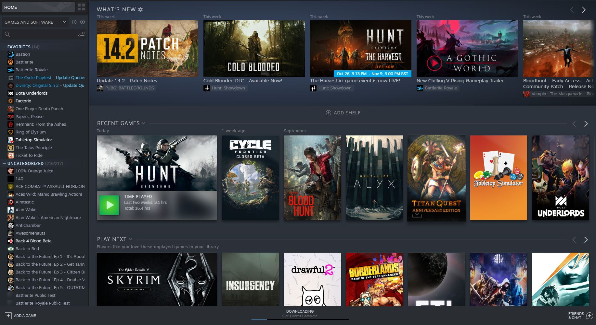

---

## Wieghtlifting & Climbing

---

## Travel

---

<!-- _class: invert lead -->

# What does Jesper Dramsch do?

---

## Starting the conversation 2011 <!--fit-->

 

* No bug fixes
* No compilation instruction
* No version control
* Saved on a USB stick
 
* Main research output

---

## Starting the conversation 2011 <!--fit-->

 

* Use git for versions
* Write a manual
* Maybe get a "software person" (funding?)
* Guide for bug fixes

<!--My work-->

---

## New lab new procedures <!--fit-->

 

* Consulted on software best-practices
* Advocated for open-source solutions
* Python instead of Matlab

---

## My open-source PhD

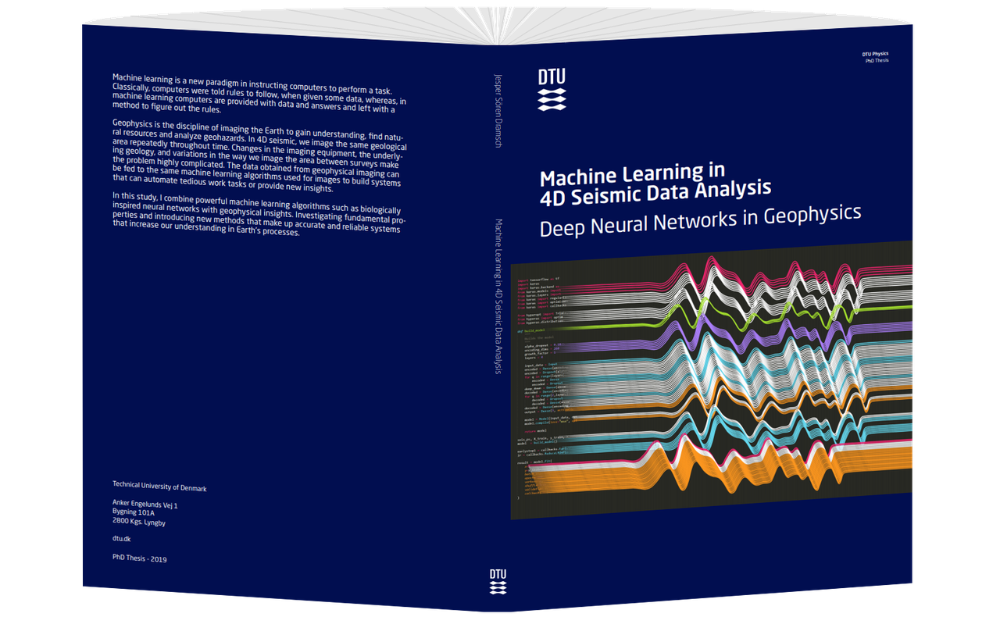

[[dramsch.net/phd](https://dramsch.net/phd)]

<!-- All papers with open sourced code -->
<!-- Created a Python library -->

---

## Other Shenanigans

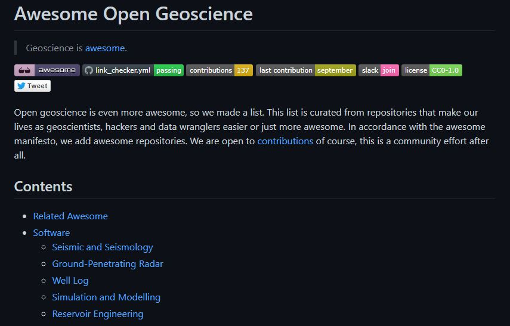

---

## Other Shenanigans

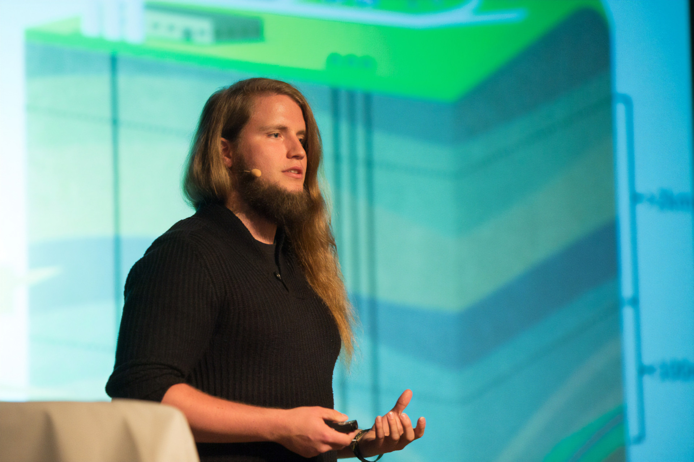

<!--organized a mentored sprint-->

---

## ECMWF

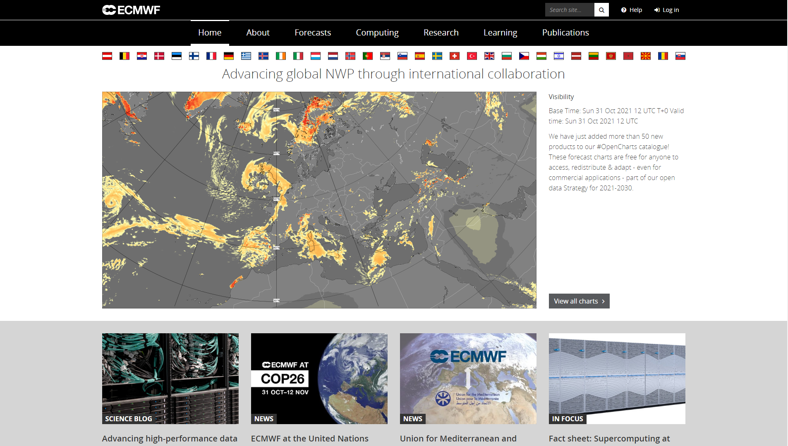

Scientist for Machine Learning 🎉

---

<!-- _class: invert lead -->

# What are my plans for the fellowship?

---

## Community

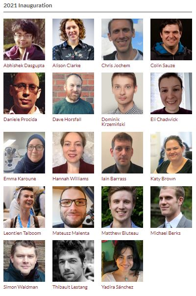 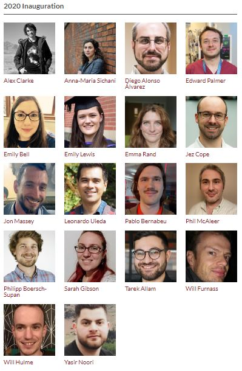 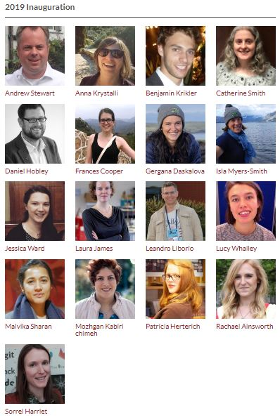

---

## Workshop

 

<!--Organise a workshop around making ML sustainable for researchers-->

---

## Youtube

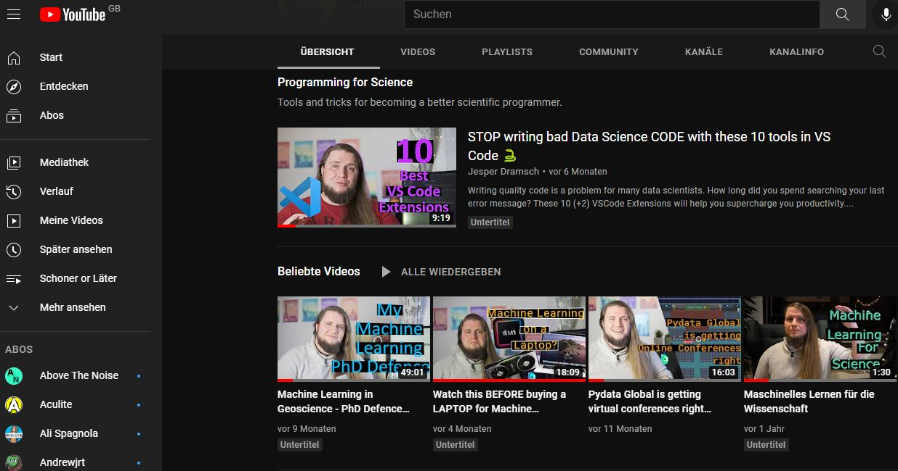 

---

## Talks

---

## Writing

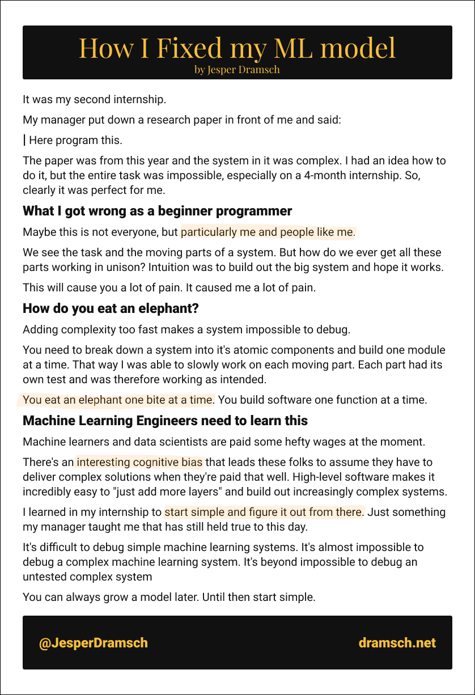 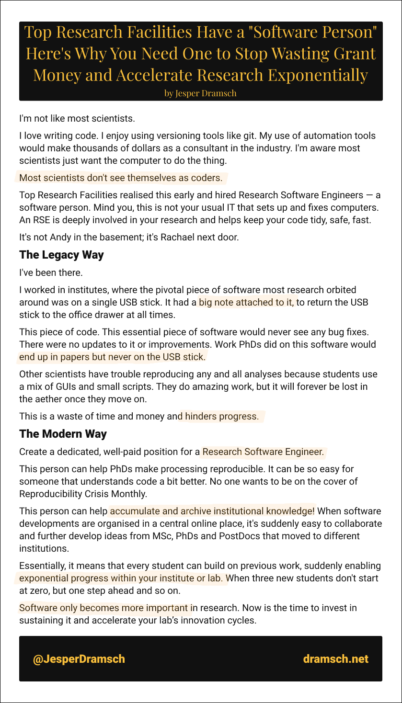
