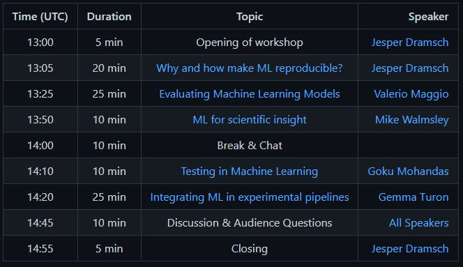

<!-- _class: invert lead -->

# Introduction

---

<!-- _class:  lead -->

💡 Workshop Website
 
realworld-ml.xyz

---

## Speakers

* Goku Mohandas, [madewithml.com](https://madewithml.com) 
* Mike Walmsley, University of Manchester 
* Gemma Turon, [Ersilia](https://www.ersilia.io/) 
* Valerio Maggio, [Anaconda Inc.](https://www.anaconda.com/) 
* Jesper Dramsch, [ECMWF](https://www.ecmwf.int) 

---

## Schedule

