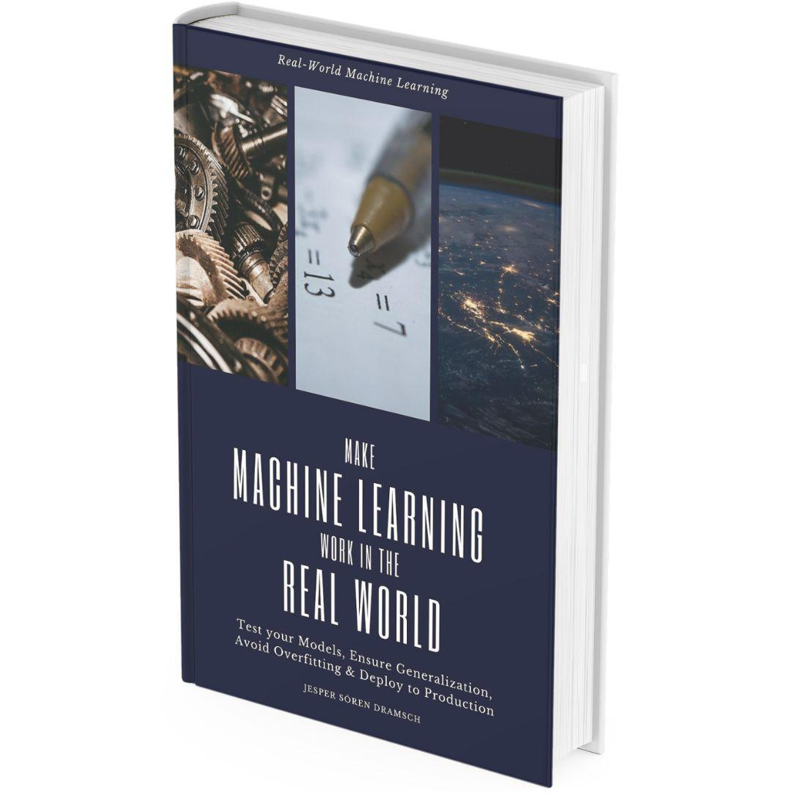

<!-- _class: invert lead -->

# Why and how make ML reproducible? <!--fit-->

Jesper Dramsch

---

<!-- _class:  lead -->

🤷 Why, tho?

---

# Why Reproducibility<!--fit-->

* Make an Impact
* Scientific Results
* Human Progress
* Ethical Work
* Funding Bodies
* Easy to Reuse
* Gift to ourselves

---

<!-- _class: invert lead -->

# Bad ML and bad science hurt people. <!--fit-->

---

<!-- _class:  lead -->

🤷 How, tho?

---

## Model Evaluation<!--fit-->

* Ensure valid results
* Reviewer should reject bad evaluation
* Reduce impact of dependence
* Adress real-world class distribution

---

## How hard is that?<!--fit-->

   Medium hard... dramsch.net/books

---

## Benchmarking

* Collaboration
* Dummy Classifiers
* Domain solutions
* Benchmark Datasets
* Simple models
* i.e. Random Forest, Linear Models

---

## Model Sharing

* Export & Share model checkpoints
* Fix sources of randomness
* Linting & Formatting
* Docstrings
* Dependencies
* Docker

---

# Testing

* Deterministic Tests
* Data Sample Tests
* Docstrings for Tests
* Input Data Validation

---

# Interpretability <!--fit-->

* Scikit-Learn Tools
* Shap Explainability
* Model Inspection
* Communicate Results
* Build Intuition

---

## Ablation Studies <!--fit-->

* Building ML is iterative
* Remove components of solution
* Shows the impact on final pipeline

---

<!-- _class:  lead -->

🤷 Where, tho?

* realworld-ml.xyz

--- 

<!-- _class: invert lead -->

# Make it Easy to Use

## People might use it!