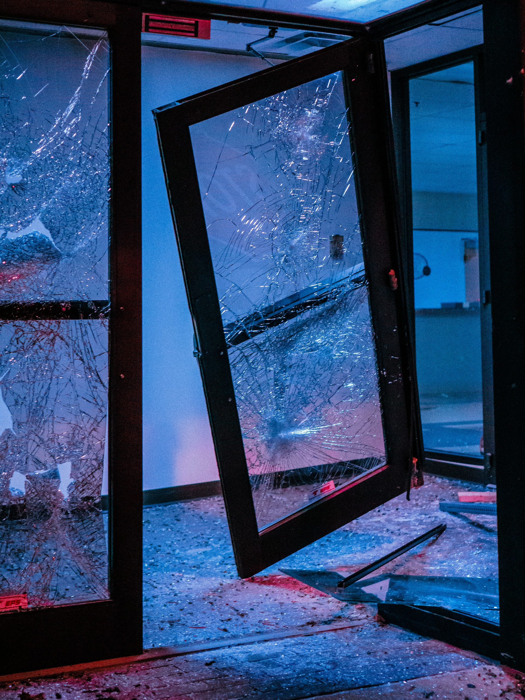

<!-- _class: invert lead -->

# How to find your people actually? <!--fit-->

Jesper Dramsch

---

<!-- _class:  lead -->

🚀 A singular neurodivergent perspective from years of participating in, leading, building, and abandoning communities.

---

## Easy Communities? <!--fit-->

* Money
* Relationships
* Fame

Problem?

You have to deal with people that only care about Money, Relations, and Fame

---

# "My" communities?<!--fit-->

* Queer Munches
* Gaming Discords
* Twitch Chats
* Python groups
* Professional Communities
* SSI Fellows Group

---

## What made me leave? <!--fit-->

* Lack of diversity
* Personality cults
* Lack of Recognition
* Questionable ethics
* Poisoned Wells
* Not getting included

---

## What works? <!--fit-->

* Codes of Conducts
* Strong moderation
* Easy access
* Being welcoming
* Involve keen people
* Send out cool stuff

---

<!-- _class: invert lead -->

# What are some strategies? <!--fit-->

Building a common belief system!

Inspired by "Tribal Marketing"

---

## 🍼 **The Creation Story**

> “Where you come from is as important for people to know as what you believe and what your advantages are.” 

Every belief system comes with a story. 

*Gilligan’s Island* and *The Brady Bunch* began with a theme song that outlined the story’s premise, Schwartz said, “Because the confused do not laugh.”

---     
## ✨ **The Values**

Defining, understanding and communicating your mission to community members is critical to your community success. 

- Coke lets everyone know “It’s the real thing.” 
- Nike says, “Just do it.” 
- Campbell’s makes it clear that “Soup is good food.” 

---
## 🌑 **The Icons & Tokens**

Identity and values resonate from icons and their instant concentrations of meaning. 

- Pronoun pins
- Emoji in Twitter name
- The Stanley Cup

People in the public eye can also become icons, such as Virgin’s Richard Branson. 

---
## 🔥 **The Rituals**

> “Rituals are the repeated interaction that people have with your enterprise” 

and they can be imbued with either positive or negative meaning. 

Communities must consider how they can make these touchpoints with their values and ideology more pleasant, engaging, enhanced, simplified, less frustrating, and more fun.

---
## 😈 **The Unbelievers**

For every believer, there is a nonbeliever.

These unbelievers allow believers to define themselves through contrast. By defining the unbelievers, you define who you are by demonstrating the antithesis of your position. 

That’s why 7Up declared itself the “uncola” and Taco Bell wants us to “think outside the bun.” 

---
## 💬 **The Common Language**

You must know a group’s sacred words to belong within that group. 

These sacred words set people apart from others and bind them together as members of a group. This specific language helps them work together effectively. 

---

## 📚 **The Mentors**

> “All successful belief systems have a person who is the catalyst, the risk taker, the visionary, the iconoclast…”

Talk about thought leaders in your space!

Possibly recruit them to your community!

---
## 🦸‍♀️ **The Superpowers**
    
Common insights, shortcuts and knowledge of the group that accelerates their power and productivity.

Shared resources, meetings, access to things and accelerated results.

---
## 🙌 **Don't go alone**

You'll start alone.

Someone said to me building a community is training other leadership to take your community further.

--- 

## 🤝 From the discussion:

All of these aspects of community live on a spectrum.

From loose acquaintances to zealous cult, we probably want to hit the middle somewhere.

Choose what you care about and pursue it with integrity.

Include your kind of people.

--- 

<!-- _class: invert lead -->

# Communities are hard

## Try and make it easier for you