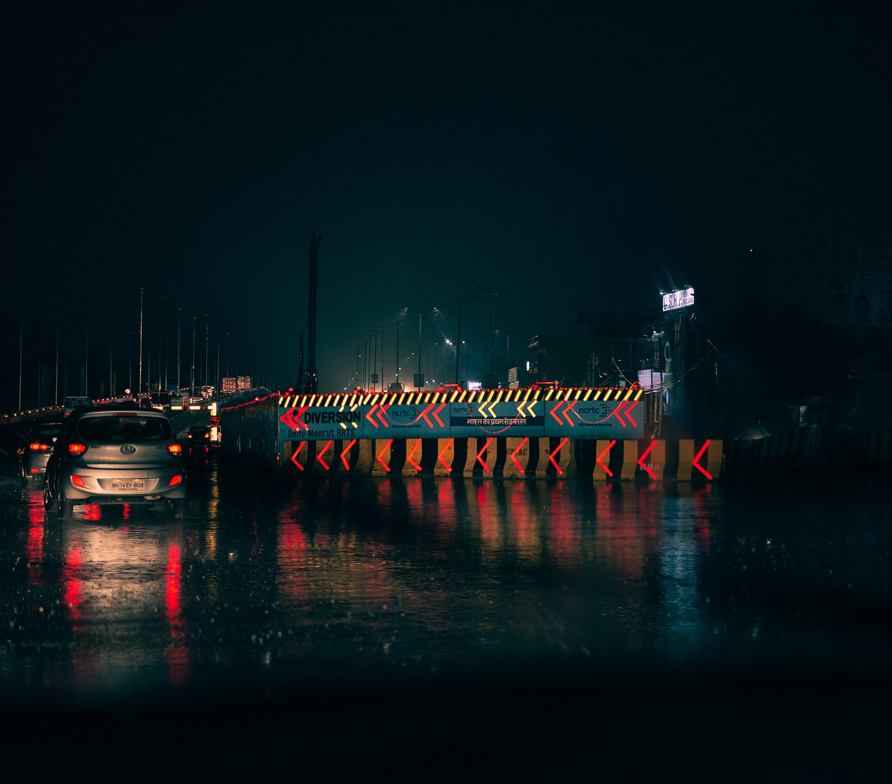
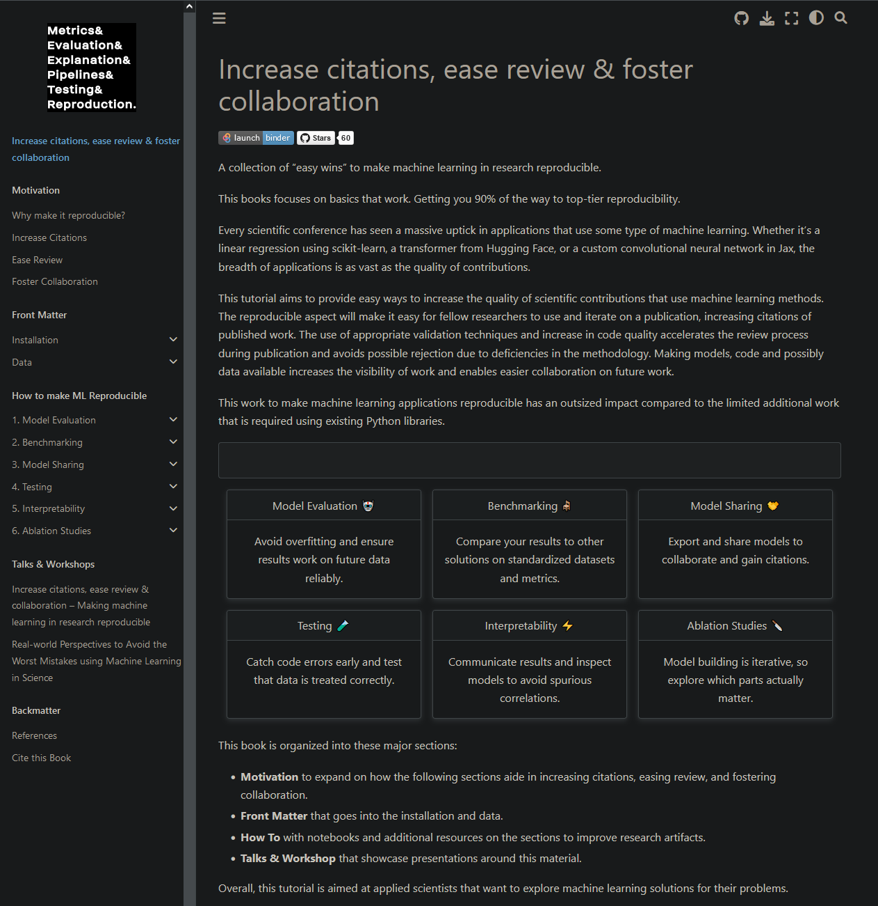

<!-- _class: invert lead -->

# A Year of "AI" Shenanigans <!--fit-->
## SSI Fellows Update
Jesper Dramsch (2022 Cohort)

---

<!-- _class:  lead -->

🚀 Tackling the looming reproducibility crisis in science that uses machine learning in a world consumed by AI hype.

---

## The 2022 Plan <!--fit-->

* 🤗 Participate in Community
* 🛠️ Create a workshop
* 🎥 Do YouTube 
* ✒️ Write articles 
* 📣 Give Talks

<!--Photo by Glenn Carstens-Peters on Unsplash-->

---

## Slight Diversion: A tutorial<!--fit-->

* Reproducibility in ML for Science
* 6 Jupyter Notebooks
* EuroScipy
* "Hiding the Brokkoli"

<!--Photo by Ashwini Chaudhary(Monty) on Unsplash-->

---

<!-- _class:  lead -->

🥦 Increase citations, ease review & foster collaboration

---

## Bad Conscience: A Workshop <!--fit-->

* Recruit fellow fellows
* Write proposal in days
* Get accepted way late
* Make an awesome workshop anyways
* 2 hours with 70 people

<!--Photo by Chris Montgomery on Unsplash-->

---

<!-- _class: invert lead -->

# [realworld-ml.xyz](https://realworld-ml.xyz) <!--fit-->

---

## Take it all the way <!--fit-->

* Make Tutorial accessible and appealing
* Jupyter Book
* Extra Content
* Visually Appealing
* Search-enginey

---

<!-- _class: invert lead -->

# [ML.Recipes](https://ml.recipes) <!--fit-->

---

# Other stuff 

* Reproducible ML at work
* Taught MOOC to 7,000 people
* Skillshare courses with ethical and reproducible AI (6,500 total students)
* 5 SSI and several of mine Blog posts
* 20 Youtube Videos with 1.4M impressions
* Guest on multiple Podcasts
* Multiple talks and guest lectures

---

## Budding Community <!--fit-->

* Machine Learning
* But make it inclusive
* 🏳‍🌈-friendly
* Neurodivergent
* Do my best on everything else

<!--Photo by Shane Rounce on Unsplash-->

---

<!-- _class: invert lead -->

# [The Latent Space](https://latent.club) <!--fit-->

[latent.club](https://latent.club)

---

<!-- _class: invert lead -->

# Have fun with your Fellowship

## Embrace the Chaos!